# Drip

[](https://github.com/gary322/drip/actions/workflows/ci.yml)

Production-grade, headless **fashion + styling + virtual try-on** system designed to be used via:
- **ChatGPT** (Model Context Protocol / MCP tools + an in-chat “Style Map” widget)
- **iMessage/SMS** (via a macOS bridge)
- **WhatsApp** and **Telegram** (webhook + sender workers)

Core principles:
- **Server-side data**: user photos, profiles, budgets, and generated try-ons are stored on *your* infra (Postgres + object storage).
- **Explicit consent**: purchase is always gated by an **approval link**.
- **Real try-on only**: production is locked to **Google Vertex AI Virtual Try-On** (no “fake” local compositor fallback).
- **Full-body enforcement**: the system rejects non head-to-toe images (and can require feet + front-facing).

The main product lives in `fashion-mcp/`.

## Table of Contents

- What’s Implemented
- Architecture
- Deployment Topology (AWS + GCP + macOS)
- Public Surface Area
- Data Model
- Key Flows
- Photo Requirements (Non-Negotiable)
- Configuration Reference
- Repo Layout
- Documentation Index
- Local Development
- AWS Deployment
- Omnichannel Setup (WhatsApp/Telegram/iMessage)
- Operational Notes (Production)
- Security & Privacy Notes
- ChatGPT Usage (MCP)
- iMessage Bridge (macOS)
- Secrets / Safety
- Troubleshooting
- Status

## What’s Implemented

**Styling + planning**
- Store a user budget/goals/sizes.
- Generate capsules/outfits within a budget.
- “Style Space” map widget rendered inside ChatGPT.

**Try-on**
- Async try-on jobs (`tryon.renderItemOnUser`, `tryon.renderOutfitOnUser`, `tryon.getJobStatus`).
- Production try-on uses **Google Vertex AI Virtual Try-On** (`TRYON_PROVIDER=google_vertex` + `TRYON_PROVIDER_STRICT=true`).
- Generated images are written to **S3** and returned as **presigned URLs**.

**Full-body validation**
- Photo ingestion rejects headshot / cropped photos (`full_body_photo_required`).
- Strict mode calls a MediaPipe-based validator service (Python sidecar) to enforce:
  - head-to-toe framing
  - minimum resolution / aspect ratio
  - feet visibility (optional)
  - front-facing likelihood

**Checkout**
- Budget enforcement at checkout (block over-budget unless explicitly allowed).
- Stripe checkout session creation when `CHECKOUT_PROVIDER=stripe`.
- Always returns an approval link (`/approve/:token`) for explicit consent.

**Auth**
- `AUTH_MODE=dev` for local/dev testing and scripted e2e runs.
- `AUTH_MODE=oauth` for production (JWT validation via JWKS; works with Auth0/Okta/Cognito). See `fashion-mcp/README.md`.

**Omnichannel**
- iMessage bridge app (runs on macOS) that relays inbound/outbound messages + attachments.
- WhatsApp/Telegram sender + webhook support is implemented but disabled by default in AWS deploy.

## Architecture

### High-level (runtime)

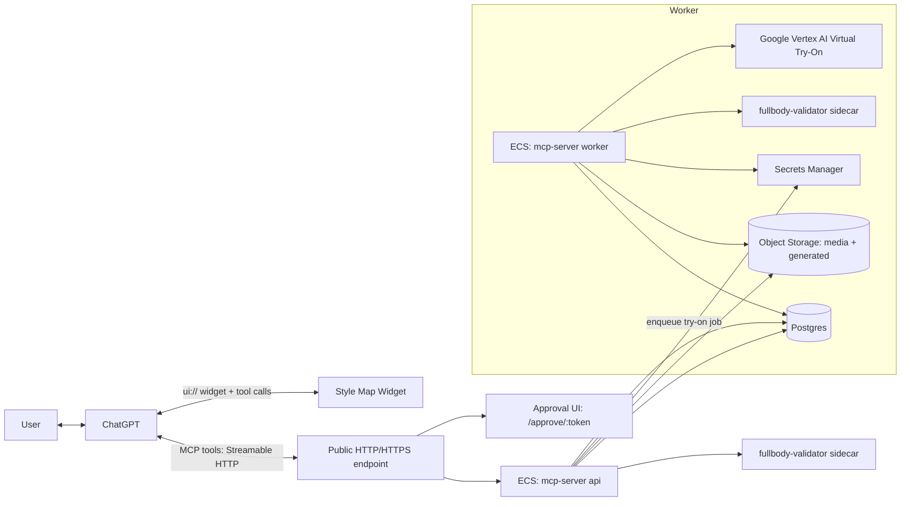

Notes:
- The MCP server enforces `Origin` validation (DNS rebinding protection) per MCP Streamable HTTP guidance.
- Production is locked to `TRYON_PROVIDER=google_vertex` with `TRYON_PROVIDER_STRICT=true` so the local compositor can’t accidentally run.
- iMessage is bridged from macOS and is not deployed on AWS.

## Deployment Topology (AWS + GCP + macOS)

This system is intentionally **headless**: it exposes MCP tools + minimal HTML pages for approvals/linking.

Key reality to plan for:
- **Compute + storage** live in **AWS** (ECS + RDS + S3).
- **Try-on generation** runs in **Google Vertex AI** (your GCP project/region). That means user photos and garment images are transmitted to Google as part of the try-on call.
- **iMessage/SMS** requires **macOS** (a Mac mini/MacStadium host) because Messages.app is not available on AWS.

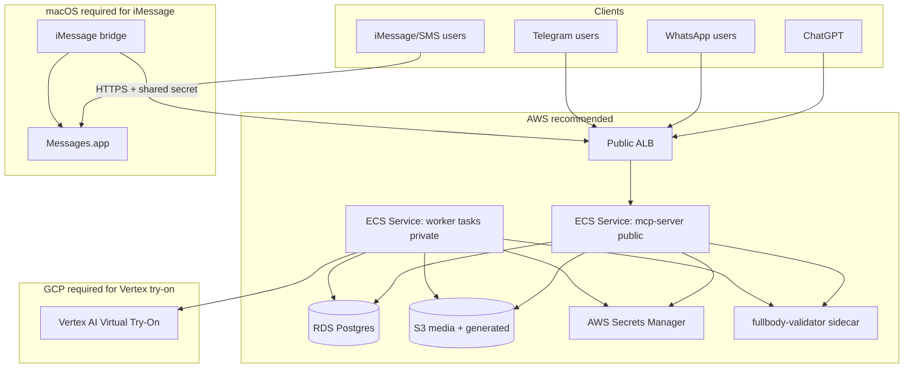

## Public Surface Area

This is what you should expect to be reachable at your `PUBLIC_BASE_URL`:
- `GET /` (JSON index of endpoints)
- `GET /healthz`
- `POST /mcp` (MCP Streamable HTTP JSON-RPC)
- `GET /approve/:token`
- `POST /approve/:token/decision`
- `GET/POST /channels/whatsapp/webhook` (only if `WHATSAPP_ENABLED=true`)
- `POST /channels/telegram/webhook` (only if `TELEGRAM_ENABLED=true`)
- `GET /channels/link/:token` and `POST /channels/link/complete` (link a channel identity to a user id)
- `POST /webhooks/stripe` (only if `CHECKOUT_PROVIDER=stripe`)
- iMessage bridge (only if `IMESSAGE_BRIDGE_ENABLED=true`): `POST /channels/outbox/claim`
- iMessage bridge (only if `IMESSAGE_BRIDGE_ENABLED=true`): `POST /channels/outbox/:id/sent`
- iMessage bridge (only if `IMESSAGE_BRIDGE_ENABLED=true`): `POST /channels/outbox/:id/failed`
- iMessage bridge (only if `IMESSAGE_BRIDGE_ENABLED=true`): `POST /channels/imessage/events`
- iMessage bridge (only if `IMESSAGE_BRIDGE_ENABLED=true`): `POST /channels/imessage/upload`

### Example try-on outputs (repo assets)

Try-on triptych (person | garment | output):


Budget demo (two cases):


## Data Model

Postgres is the source of truth for users, profiles, photos, try-on jobs, approvals, and omnichannel message state.
It also tracks idempotency keys, audit events, Stripe webhook dedupe, and message delivery attempts/dead-lettering.

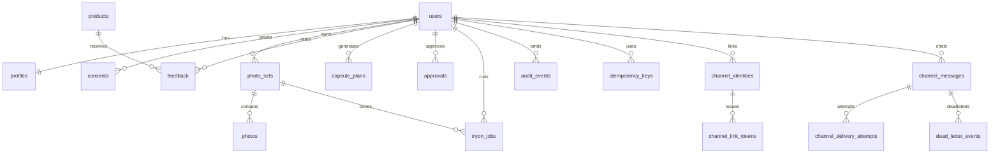

For the exact schemas and migrations, see:
- `fashion-mcp/apps/mcp-server/src/db/migrations/`

## Key Flows

### 1) Photo ingestion + full-body enforcement

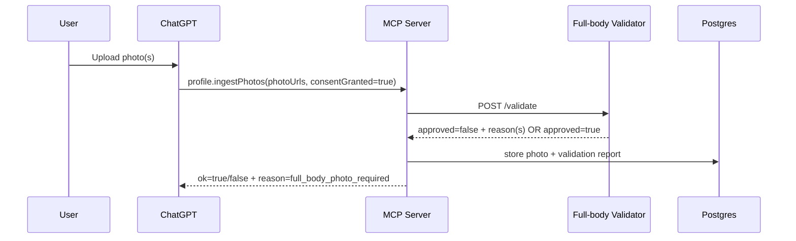

If a user uploads a cropped/upper-body image, the system rejects it with:
- `reason: "full_body_photo_required"`

### 2) Virtual try-on (async job)

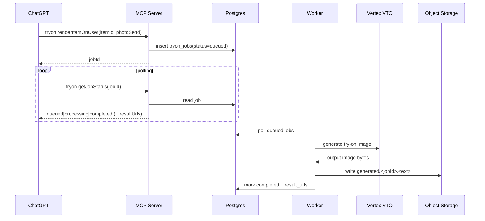

Privacy note: the try-on image generation step sends the user photo and garment image to Google Vertex AI in your configured region/project. Ensure you collect and store user consent.

### 3) Budget + approval + Stripe checkout

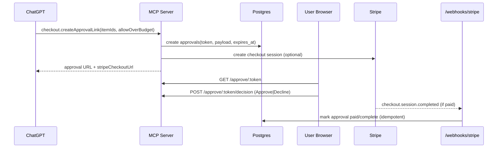

### 4) Omnichannel messaging (WhatsApp / Telegram / iMessage)

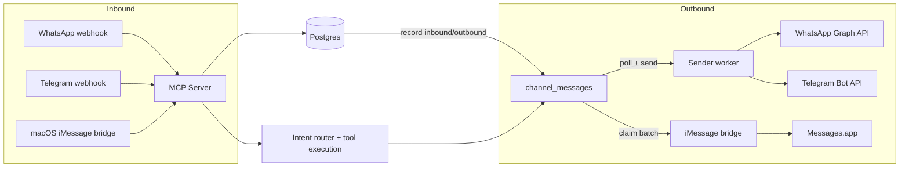

Notes:
- Inbound webhooks are verified (WhatsApp signature / Telegram secret token).
- Unlinked users are prompted to link via a short-lived `/channels/link/:token` URL.
- After linking, the user is prompted to send a full head-to-toe photo (feet visible, front-facing).

### 5) Channel linking (how WhatsApp/Telegram/iMessage maps to a user)

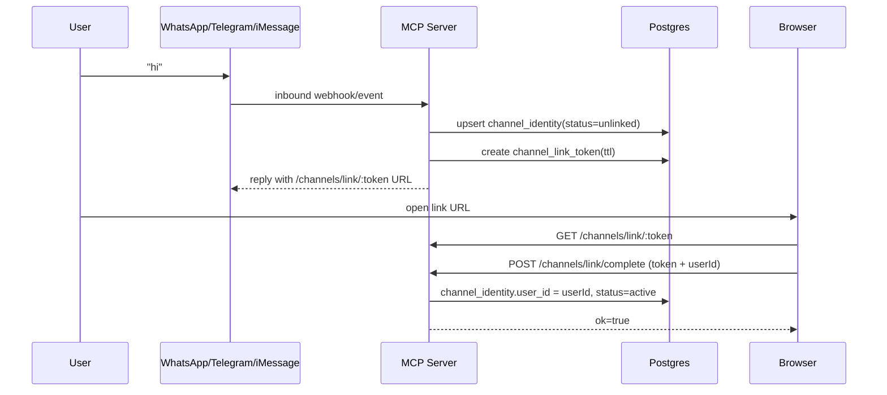

Important: the linking page in this repo is intentionally minimal (it asks for a `userId`).
For a true production roll-out, you should replace it with: “open link → login with Auth0 → backend completes link”.

### 6) iMessage bridge outbox + attachments

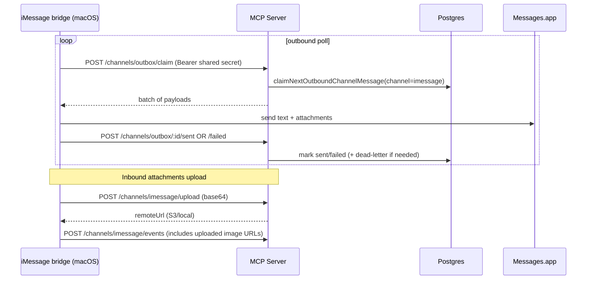

## Photo Requirements (Non-Negotiable)

If you want real try-on results, the system must have at least one **approved** photo that is:
- Full body, head-to-toe
- Front-facing (or close to front-facing)
- Feet visible (recommended; enforced when `FULLBODY_REQUIRE_FEET_VISIBLE=true`)
- Not heavily cropped, not mirror-cropped, not extreme wide angle
- At least `TRYON_MIN_FULL_BODY_WIDTH_PX` × `TRYON_MIN_FULL_BODY_HEIGHT_PX` (defaults: 512×900)

If a user sends anything else, you should respond with a hard requirement:
> “Please upload a full head-to-toe, front-facing photo with feet visible.”

The backend enforces this in `profile.ingestPhotos` and returns:
- `ok: false`
- `reason: "full_body_photo_required"`

## Configuration Reference

The implementation is intentionally **feature-flagged** by env vars so you can run “all-in-one” locally and split roles in production.

### Hard production gates (validated at startup)

When `NODE_ENV=production`:
- `TRYON_PROVIDER` must be `google_vertex`
- `ASSET_STORE_PROVIDER` must be `s3`
- If `TRYON_REQUIRE_FULL_BODY_PHOTOS=true`, `FULLBODY_VALIDATOR_MODE` must be `strict`

### Key env vars (by subsystem)

Try-on:
- `TRYON_PROVIDER=google_vertex`
- `TRYON_PROVIDER_STRICT=true` (prevents using the local compositor fallback)
- `GOOGLE_CLOUD_PROJECT`, `GOOGLE_CLOUD_LOCATION` (plus standard GCP auth via `GOOGLE_APPLICATION_CREDENTIALS`)

Full-body enforcement:
- `FULLBODY_VALIDATOR_MODE=strict`
- `FULLBODY_VALIDATOR_URL=http://127.0.0.1:8090/validate`
- `FULLBODY_REQUIRE_FEET_VISIBLE=true|false`

Storage:
- `ASSET_STORE_PROVIDER=s3`
- `ASSET_S3_BUCKET=...`
- `ASSET_S3_PRESIGN_TTL_SECONDS=3600`

Checkout:
- `CHECKOUT_PROVIDER=stripe`
- `STRIPE_SECRET_KEY=...`
- `STRIPE_WEBHOOK_SECRET=...`

Omnichannel:
- WhatsApp: `WHATSAPP_ENABLED=true` + `WHATSAPP_ACCESS_TOKEN`, `WHATSAPP_APP_SECRET`, `WHATSAPP_PHONE_NUMBER_ID`, `WHATSAPP_WEBHOOK_VERIFY_TOKEN`
- Telegram: `TELEGRAM_ENABLED=true` + `TELEGRAM_BOT_TOKEN`, `TELEGRAM_WEBHOOK_SECRET_TOKEN`
- iMessage: `IMESSAGE_BRIDGE_ENABLED=true` + `IMESSAGE_BRIDGE_SHARED_SECRET`

## Omnichannel Setup (WhatsApp/Telegram/iMessage)

### WhatsApp (Meta Cloud API)

1. Deploy the backend to a stable HTTPS URL (`PUBLIC_BASE_URL`).
2. Set `WHATSAPP_ENABLED=true` and required WhatsApp env vars (see above).
3. In Meta developer console:
   - Set webhook URL to: `https://YOUR_DOMAIN/channels/whatsapp/webhook`
   - Set verify token to: `WHATSAPP_WEBHOOK_VERIFY_TOKEN`
4. Confirm the `GET /channels/whatsapp/webhook` verification succeeds.

### Telegram

1. Create a bot with BotFather and get `TELEGRAM_BOT_TOKEN`.
2. Choose a random `TELEGRAM_WEBHOOK_SECRET_TOKEN`.
3. Set `TELEGRAM_ENABLED=true` + the required env vars.
4. Configure Telegram webhook (example):

```bash
curl -sS -X POST "https://api.telegram.org/bot$TELEGRAM_BOT_TOKEN/setWebhook" \
  -d "url=https://YOUR_DOMAIN/channels/telegram/webhook" \
  -d "secret_token=$TELEGRAM_WEBHOOK_SECRET_TOKEN"
```

### iMessage/SMS

See `fashion-mcp/apps/imsg-bridge/README.md` for full details.

## Operational Notes (Production)

- Queueing: try-on jobs are stored in Postgres (`tryon_jobs`) and processed by a separate worker task (`TRYON_WORKER_ENABLED=true`).
- Idempotency:
  - MCP tools accept `idempotencyKey` to prevent duplicate work on retries.
  - Webhooks are deduped (Stripe events in `stripe_webhook_events`; channel provider message ids in `channel_messages`).
- Audit: sensitive actions write audit events to `audit_events`.
- Storage:
  - Media + generated outputs should be stored in object storage (`ASSET_STORE_PROVIDER=s3`) and returned as presigned URLs.
- Rate limiting:
  - This starter uses an in-memory limiter; for multi-instance production, move to a shared store (e.g., Redis) and enforce per-user/per-client policies.

### State Machines

Try-on job lifecycle (`tryon_jobs.status`):

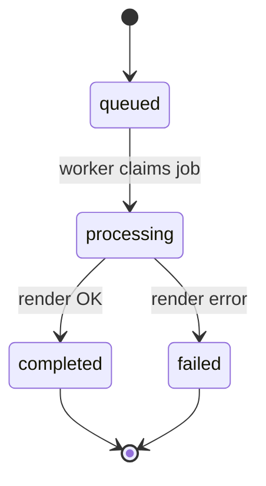

Channel message lifecycle (`channel_messages.status`):

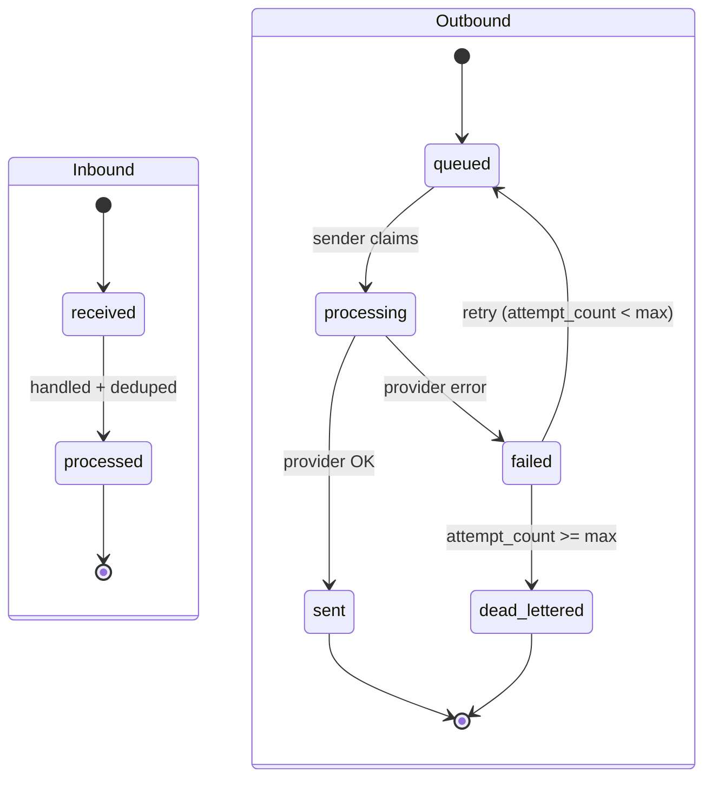

## Security & Privacy Notes

- Always collect explicit user consent before storing photos or generating try-on images.
- Secrets must be stored in a secret manager (AWS Secrets Manager in the provided deploy) and injected at runtime.
- Try-on generation uses Google Vertex AI; user photos/garment images are sent to Vertex in your configured project/region. Ensure your privacy policy and consent flows reflect this.
- If enabled, WhatsApp/Telegram providers receive message content and media required to deliver messages on those networks.
- If using Stripe, payment events and session metadata are sent to Stripe (do not store raw card data).

### Data Processors (Where Data Goes)

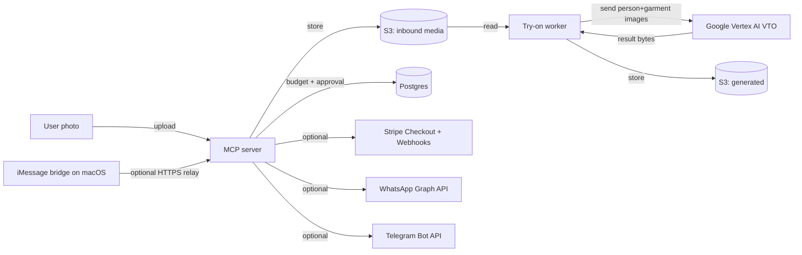

### Encryption / Retention (AWS Stack Defaults)

The provided Terraform stack (`fashion-mcp/infra/aws/`) enables:
- RDS storage encryption (`storage_encrypted=true`).
- S3 public access blocks + server-side encryption (SSE-S3 AES256) + versioning.
- Lifecycle rule expiring **noncurrent** object versions after 30 days.

If you have compliance requirements (SOC2, HIPAA-like internal policies, etc.), you should additionally:
- Use SSE-KMS with a customer-managed KMS key (instead of SSE-S3).
- Add explicit retention policies for current objects (media + generated) and a deletion/purge job.

### Deletion Semantics (Current Implementation)

- `profile.deletePhotos` **soft-deletes** `photo_sets` + `photos` rows (sets `deleted_at`).
- Physical deletion of objects in S3/local storage is not automatically performed by the backend.
  - For hard deletion requirements, add a sweeper job that deletes `storage_url` objects for deleted photos/try-ons and prunes DB rows.

## Repo Layout

- `fashion-mcp/` (main monorepo)
- `fashion-mcp/apps/mcp-server/` (MCP server + widget resources)
- `fashion-mcp/services/fullbody-validator/` (strict full-body validator; FastAPI + MediaPipe)
- `fashion-mcp/apps/imsg-bridge/` (macOS iMessage/SMS bridge that talks to the backend over HTTPS)
- `fashion-mcp/infra/aws/` (Terraform + deploy script for AWS: ECS Fargate + ALB + RDS + S3)

## Documentation Index

- Product overview + local dev: `fashion-mcp/README.md`
- AWS deploy: `fashion-mcp/infra/aws/README.md`
- Tool contracts: `fashion-mcp/docs/tool-contracts.md`
- Production checklist: `fashion-mcp/docs/production-checklist.md`

## Local Development

See `fashion-mcp/README.md` for full details. Quick path:

```bash
cd fashion-mcp
docker compose up -d
npm install
npm run db:migrate
npm run db:seed
npm run dev
```

Server:
- `GET http://localhost:8787/healthz`
- `POST http://localhost:8787/mcp`

Run tests:

```bash
cd fashion-mcp
npm test
npm run test:integration
node scripts/e2e_fullbody_enforcement.mjs
node scripts/e2e_stripe_budget_checkout.mjs
```

## AWS Deployment (Recommended)

The AWS deploy is automated via Terraform + a deploy script:

- Infra: `fashion-mcp/infra/aws/`
- Deploy script: `fashion-mcp/infra/aws/scripts/deploy.sh`

From `fashion-mcp/infra/aws`:

```bash
./scripts/deploy.sh
```

Outputs:
- Base URL: ALB (HTTP by default)
- Health: `GET /healthz`
- MCP: `POST /mcp`

Notes:
- ECS tasks are configured for **ARM64** (matching images built on Apple Silicon).
- The default Terraform config is set to run ECS tasks in **public subnets with public IPs**
  to avoid NAT gateway + EIP quota requirements. For production hardening, enable NAT and
  move tasks to private subnets.
- Secrets must be stored in **AWS Secrets Manager** (deploy script writes them).

Details: `fashion-mcp/infra/aws/README.md`

## ChatGPT Usage (MCP)

This server validates `Origin` to prevent DNS rebinding. In production, allow:
- `https://chatgpt.com`
- `https://www.chatgpt.com`

For local scripts/tests, set:

```bash
MCP_ORIGIN='https://chatgpt.com'
```

## iMessage Bridge (macOS)

iMessage is not available on AWS. Run the bridge on macOS:
- `fashion-mcp/apps/imsg-bridge/README.md`
- Requires installing `imsg` on the Mac and granting permissions for Messages.app automation.

## Secrets / Safety

Do **not** commit secrets.
- `google.txt`, `stripe.txt`, and `.secrets/` are intended as local-only inputs.
- AWS deploy uses Secrets Manager and injects values into ECS at runtime.

## Troubleshooting

- `Cannot GET /`:
  - The server should expose `GET /` and `GET /healthz`. Confirm you’re hitting the right port and that the process is running.
- `reason: full_body_photo_required`:
  - The uploaded photo is not head-to-toe (or fails strict validation). Re-upload a full-body front-facing photo with feet visible.
- Try-on returns “completed” but image URL 403/expired:
  - Presigned URLs expire (see `ASSET_S3_PRESIGN_TTL_SECONDS`). Re-fetch via `tryon.getJobStatus`.
- `whatsapp_disabled` / `telegram_disabled`:
  - You didn’t enable the channel (`WHATSAPP_ENABLED=true` / `TELEGRAM_ENABLED=true`).
- `unauthorized_bridge` for iMessage routes:
  - The bridge must send `Authorization: Bearer $IMESSAGE_BRIDGE_SHARED_SECRET`.

## Status

AWS deployment has been exercised with:
- `/healthz` passing (DB up, strict full-body validator up, try-on provider `google_vertex`, checkout provider `stripe`)
- End-to-end try-on producing an S3 presigned image URL (Google Vertex VTO)
- Stripe budget enforcement producing blocked + allowed approval flows
