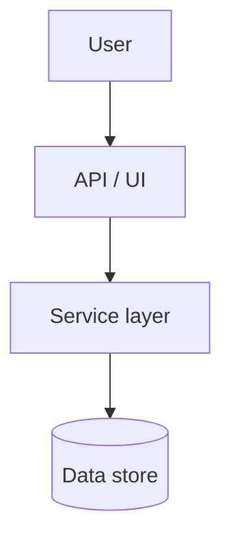

# Design: Deploy fashion-mcp to AWS with production-ready infra, tests, and docs

## Overview

{{2-3 sentences explaining the technical approach}}

## Architecture

### Component diagram (edit to match the codebase)

### Key components

- **{{component}}**: {{responsibility}}
- **{{component}}**: {{responsibility}}

## Data model / state

- {{entity}}: {{fields, constraints}}

## Interfaces / APIs

- **Inputs**: {{request shape / function params}}
- **Outputs**: {{response shape / return type}}
- **Errors**: {{error cases and codes}}

## File-level changes

| File | Action | Purpose |
|------|--------|---------|
| {{path}} | Create/Modify | {{why}} |

## Failure modes & error handling

- {{scenario}} → {{handling strategy}} → {{user-visible behavior}}

## Edge cases

- {{edge case}} — {{handling}}

## Security & privacy

- {{authentication/authorization concerns}}
- {{data handling / logging constraints}}

## Performance considerations

- {{performance risks and mitigation}}

## Test strategy

Map tests back to acceptance criteria.

- **Unit**: {{units to test}}
- **Integration**: {{integration points}}
- **E2E**: {{user flows}}

## Rollout / migration plan (if needed)

- {{steps}}

