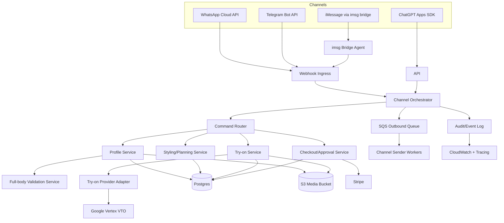

# Design: Enforce full head-to-toe capture and deliver try-on via iMessage, ChatGPT, WhatsApp, Telegram

## Overview

Extend the current MCP server into an omnichannel orchestration platform with strict server-side photo validation. Keep MCP as the canonical business API and add channel adapters that translate external channel events into the same internal commands. Introduce a dedicated full-body validation pipeline that blocks try-on unless a photo is explicitly approved as head-to-toe and front-facing.

## Architecture

### Component diagram



### Runtime decomposition

- `apps/mcp-server`: existing API process, expanded to include channel webhook ingress and command routing.
- `services/fullbody-validator` (new): pose/quality service for strict head-to-toe verification.
- `services/channel-worker` (new): outbound message senders with retry/dead-letter semantics.
- `services/imsg-bridge` (new): macOS-resident connector that runs `imsg rpc`, consumes inbound iMessage events, and relays to AWS backend.

## Canonical domain flow

1. Inbound message/event arrives from any channel.
2. Adapter verifies authenticity and maps to canonical envelope.
3. Channel identity is resolved to Auth0 user (or linking flow is triggered).
4. Intent router selects domain command.
5. Domain command executes through existing MCP tool logic or shared service layer.
6. Response payload is normalized into channel-specific outbound message(s).
7. Sender worker publishes text/image/link with delivery tracking.
8. Audit event and metrics are emitted.

## Canonical inbound/outbound contracts

### Inbound envelope (`ChannelInboundEvent`)

```ts
type ChannelType = "chatgpt" | "imessage" | "whatsapp" | "telegram";

type ChannelInboundEvent = {
  eventId: string;
  channel: ChannelType;
  channelUserId: string;
  channelConversationId: string;
  receivedAt: string;
  text?: string;
  media?: Array<{
    mediaId: string;
    mimeType: string;
    remoteUrl?: string;
    caption?: string;
  }>;
  metadata: Record<string, unknown>;
  signatureValidated: boolean;
};
```

### Outbound envelope (`ChannelOutboundMessage`)

```ts
type ChannelOutboundMessage = {
  messageId: string;
  correlationId: string;
  channel: ChannelType;
  channelConversationId: string;
  recipientId: string;
  parts: Array<
    | { type: "text"; text: string }
    | { type: "image"; imageUrl: string; caption?: string }
    | { type: "link"; url: string; title?: string }
  >;
  idempotencyKey: string;
};
```

## Full-body validation design

### Capture policy

- Primary profile photo requirements:
- Exactly one person in frame.
- Head and both feet visible.
- Front-facing body orientation.
- Minimal occlusion of torso/legs.
- Minimum dimensions and sharpness.

### Validation stages

1. `basic_file_gate`
- MIME allowlist: `image/jpeg`, `image/png`, `image/webp`.
- Size limit (example 12 MB).
- Min dimensions: 900x1400.

2. `quality_gate`
- Blur score above threshold.
- Brightness and contrast within acceptable range.

3. `pose_gate`
- Pose detector yields required landmarks with confidence >= configured threshold:
- nose, left/right shoulders, hips, knees, ankles, heels/foot indices.

4. `framing_gate`
- Person bounding box covers at least configurable fraction of image height.
- Head not cropped near top margin.
- Feet near bottom margin (prevents upper-body-only crops).

5. `orientation_gate`
- Shoulder and hip symmetry indicates front-facing orientation.
- Reject profile or heavily angled poses for primary image.

### Validation output model

```ts
type FullBodyValidationResult = {
  approved: boolean;
  score: number;
  reasons: Array<
    | "no_person_detected"
    | "multiple_people_detected"
    | "image_too_small"
    | "too_blurry"
    | "too_dark"
    | "not_front_facing"
    | "feet_missing"
    | "head_missing"
    | "body_landmarks_low_confidence"
  >;
  metrics: {
    width: number;
    height: number;
    blurScore: number;
    bodyCoverage: number;
    frontalScore: number;
    landmarkConfidence: number;
  };
};
```

### Enforcement points

- `profile.ingestPhotos`: run strict validator for each provided photo URL or uploaded media object.
- `tryon.renderItemOnUser` and `tryon.renderOutfitOnUser`: verify selected photo set has `validation_status='approved'` for primary profile photo.
- If rejected, return structured remediation message and do not queue try-on jobs.

## Channel adapter design

### ChatGPT adapter

- Keep existing MCP entrypoint (`/mcp`).
- Add shared command service under MCP tool handlers to avoid business logic duplication.
- Ensure auth challenge metadata and scopes remain aligned with Auth0 OAuth resource server.

### iMessage adapter (`imsg` bridge)

- `services/imsg-bridge` runs on macOS host.
- Bridge process model:
- Spawn `imsg rpc` subprocess.
- Call `watch.subscribe` per configured chat(s).
- Translate JSON-RPC notifications to `ChannelInboundEvent` and send to backend `/channels/imessage/events` over mutually authenticated HTTPS.
- Outbound flow:
- Bridge polls/streams outbound queue items for `imessage` channel.
- Uses `send` RPC method with `chat_id` or `chat_identifier` to deliver text/image.
- Reliability:
- Heartbeat every 10s.
- Supervisord/launchd restart policy.
- Message dedupe by `idempotencyKey`.

### WhatsApp adapter

- Inbound: `POST /channels/whatsapp/webhook`.
- Verify webhook signature and app credentials.
- Normalize text/media events into canonical envelope.
- Media retrieval done server-side using official media download flow.
- Outbound: sender worker calls WhatsApp `/messages` endpoint with text/image template.

### Telegram adapter

- Inbound: `POST /channels/telegram/webhook/:botTokenAlias`.
- Verify secret token header.
- Normalize `message` and media updates.
- Fetch file via Bot API `getFile` + download URL when needed.
- Outbound: sender worker calls `sendMessage` / `sendPhoto`.

## Identity and account linking design

### Data model

- New table `channel_identities`:
- `id`, `user_id`, `channel`, `channel_user_id`, `channel_conversation_id`, `status`, `created_at`, `updated_at`.
- Unique key: `(channel, channel_user_id)`.

- New table `channel_link_tokens`:
- One-time token for linking channel identity to Auth0 user session.
- TTL + used_at.

### Linking flow

1. Unknown channel user sends first message.
2. System replies with secure link token URL.
3. User authenticates with Auth0 and confirms linking.
4. System persists mapping and resumes normal command flow.

## Data model changes

### SQL additions

- `photos` table:
- Add `validation_status` (`pending|approved|rejected`).
- Add `validation_report` JSONB.
- Add `is_primary` boolean.

- `tryon_jobs` table:
- Add `channel` and `source_message_id` for traceability.

- New `channel_messages` table:
- Stores inbound/outbound records, status, provider IDs, retries.

- New `channel_delivery_attempts` table:
- Attempt log with response status and error payload.

- New `dead_letter_events` table:
- Failed messages/events after retry budget.

## API endpoints and interfaces

### New endpoints

- `POST /channels/whatsapp/webhook`
- `GET /channels/whatsapp/webhook` (verification challenge)
- `POST /channels/telegram/webhook/:botTokenAlias`
- `POST /channels/imessage/events` (bridge -> backend)
- `POST /channels/link/complete`
- `GET /channels/link/:token`

### Existing endpoints reused

- `POST /mcp`
- `POST /webhooks/stripe`
- `GET /approve/:token`
- `POST /approve/:token/decision`

## File-level changes

| File | Action | Purpose |
|------|--------|---------|
| `apps/mcp-server/src/photos/fullBody.ts` | Modify | Replace heuristic-only checks with strict multi-stage validator client |
| `apps/mcp-server/src/mcp/tools/profile.ts` | Modify | Enforce strict validation response and guidance flow |
| `apps/mcp-server/src/mcp/tools/tryon.ts` | Modify | Block try-on when no approved primary full-body photo |
| `apps/mcp-server/src/config.ts` | Modify | Add channel + validator configs |
| `apps/mcp-server/src/index.ts` | Modify | Register webhook routers and channel workers |
| `apps/mcp-server/src/db/migrations/004_channel_and_photo_validation.sql` | Create | Channel + photo validation schema additions |
| `apps/mcp-server/src/db/repos/channelRepo.ts` | Create | Channel identity/message persistence |
| `apps/mcp-server/src/db/repos/photoValidationRepo.ts` | Create | Validation reports and primary photo management |
| `apps/mcp-server/src/channels/types.ts` | Create | Canonical inbound/outbound event types |
| `apps/mcp-server/src/channels/router.ts` | Create | Command routing from channel events |
| `apps/mcp-server/src/channels/whatsapp.ts` | Create | WhatsApp webhook parser + sender |
| `apps/mcp-server/src/channels/telegram.ts` | Create | Telegram webhook parser + sender |
| `apps/mcp-server/src/channels/imessage.ts` | Create | iMessage backend receiver contract |
| `apps/mcp-server/src/channels/linking.ts` | Create | Account linking handlers |
| `apps/mcp-server/src/channels/senderWorker.ts` | Create | Outbound queue processing and retries |
| `apps/mcp-server/src/routes/channelWebhooks.ts` | Create | Router for channel webhooks |
| `apps/mcp-server/src/routes/channelLinking.ts` | Create | Linking routes |
| `apps/mcp-server/src/channels/*.test.ts` | Create | Unit tests for parsers and senders |
| `apps/mcp-server/src/channels/*.integration.test.ts` | Create | Integration tests for DB + queue behavior |
| `services/fullbody-validator/*` | Create | Pose/quality validator microservice |
| `services/imsg-bridge/*` | Create | macOS bridge daemon using `imsg rpc` |
| `scripts/e2e_omnichannel_smoke.mjs` | Create | Automated smoke flows for channels |
| `docs/channel-architecture.md` | Create | Operator and developer architecture docs |
| `docs/photo-capture-policy.md` | Create | User-facing capture guidance and rejection reasons |
| `docs/runbook-imsg-bridge.md` | Create | iMessage bridge setup and incident handling |

## Configuration design

### New environment variables

- `FULLBODY_VALIDATOR_MODE=heuristic|strict`
- `FULLBODY_VALIDATOR_URL=http://fullbody-validator:8090`
- `FULLBODY_MIN_LANDMARK_CONFIDENCE=0.55`
- `FULLBODY_MIN_FRONTAL_SCORE=0.65`
- `FULLBODY_REQUIRE_FEET_VISIBLE=true`
- `CHANNELS_ENABLED=chatgpt,imessage,whatsapp,telegram`
- `WHATSAPP_ACCESS_TOKEN=...`
- `WHATSAPP_PHONE_NUMBER_ID=...`
- `WHATSAPP_WEBHOOK_VERIFY_TOKEN=...`
- `WHATSAPP_APP_SECRET=...`
- `TELEGRAM_BOT_TOKEN=...`
- `TELEGRAM_WEBHOOK_SECRET=...`
- `IMSG_BRIDGE_SHARED_SECRET=...`
- `CHANNEL_OUTBOX_MAX_RETRIES=8`
- `CHANNEL_OUTBOX_RETRY_BASE_MS=500`

## Security and privacy design

- Auth0 JWT validation for all authenticated APIs.
- Channel webhook signature verification for WhatsApp and Telegram.
- iMessage bridge authentication using signed JWT and shared secret rotation.
- Encrypt media at rest in S3 with KMS keys.
- Signed short-lived URLs for media access.
- Log redaction middleware strips tokens, phone numbers, and raw URLs from info logs.
- Consent-gated processing for try-on and external provider calls.

## Reliability design

- Inbound event ingestion writes to queue first, then async processing.
- Idempotency key is required for outbound sends and command execution.
- Retry policy: exponential backoff with jitter.
- Dead-letter queue for permanent failures.
- Replay endpoint/runbook for dead-letter recovery.

## Observability design

- Structured log fields: `trace_id`, `channel`, `channel_message_id`, `user_id`, `event_type`.
- Metrics:
- `channel_inbound_total`, `channel_inbound_failed_total`
- `channel_outbound_total`, `channel_outbound_failed_total`
- `fullbody_validation_reject_total{reason}`
- `tryon_job_latency_seconds`
- `queue_lag_seconds`
- Tracing across webhook -> command -> outbound sender -> provider API.

## Testing strategy mapped to requirements

### Unit

- Full-body validator scoring and reason-code correctness (FR-2..FR-5).
- Channel parser normalization for each provider (FR-10..FR-14).
- Account linking token validation and expiry checks (FR-15).
- Retry/idempotency behavior for sender worker (FR-14, FR-25).

### Integration

- DB migrations and repository behavior for new tables.
- Webhook signature validation using known-good and known-bad payloads.
- Try-on gating with approved vs rejected photo states.
- Budget enforcement through checkout path from channel-triggered commands.

### End-to-end

- ChatGPT MCP flow: profile ingest -> strict reject -> re-upload pass -> try-on -> approval link.
- WhatsApp flow with mocked provider APIs.
- Telegram flow with mocked provider APIs.
- iMessage flow in staging using real macOS bridge host and test chat.

### Non-functional

- Load tests for inbound webhook bursts.
- Chaos tests for provider outages and queue backpressure.
- Security tests for signature replay, invalid tokens, and path traversal.

## Rollout plan

1. Phase 0: introduce schema + service scaffolding behind feature flags.
2. Phase 1: deploy strict validator in shadow mode (`observe_only`) and collect reject analytics.
3. Phase 2: enforce strict validation for new users; keep fallback for legacy photo sets.
4. Phase 3: launch Telegram + WhatsApp adapters in beta.
5. Phase 4: launch iMessage bridge with dedicated macOS host(s).
6. Phase 5: remove heuristic fallback, finalize compliance dashboards, and harden SLO alerts.

## Operational runbooks to create

- Webhook signature failures spike.
- Outbound queue backlog.
- iMessage bridge disconnected.
- False-positive spike in full-body rejections.
- Stripe webhook delay/failure.
